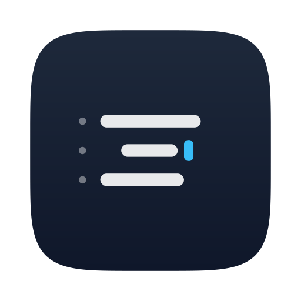
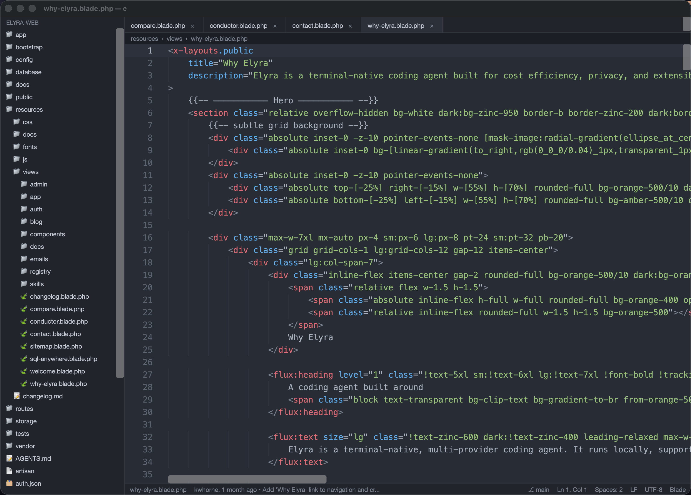
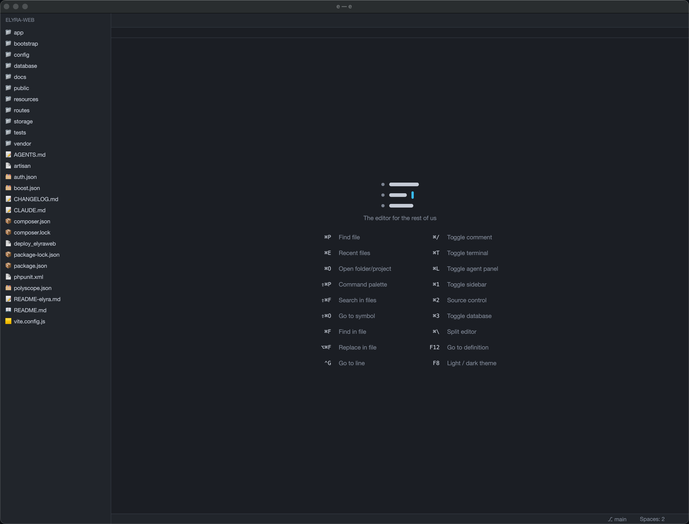

<div align="center">



**The editor for the rest of us**

A fast, native code editor written in Rust — with first-class PHP/Laravel support,
a built-in terminal, and an integrated AI agent panel.

</div>

---

## Overview

`e` is a lightweight, GPU-accelerated code editor built from scratch in Rust. It
pairs a responsive native UI with the tooling developers expect day to day —
tree-sitter syntax highlighting, Language Server Protocol support, fuzzy file
navigation, an integrated terminal, and a right-hand panel that runs CLI coding
agents (Elyra, Claude Code, Codex, …) right next to your code. The UI is
GPU-accelerated and reactive, with a focus on staying fast and out of your way.

The editor targets the modern web stack out of the box — **PHP, Laravel, Blade,
Vue, Svelte, Tailwind/CSS** — alongside general-purpose languages.

## Screenshots

<div align="center">



*Editing a Laravel Blade view — Flux UI components, Tailwind classes, tabs, breadcrumbs.*



*The welcome screen: file explorer with type icons, and the keyboard shortcut cheat sheet.*

</div>

## Features

- **Tree-sitter syntax highlighting** for 12+ languages, with file-type icons in the explorer
- **Language Server Protocol** — diagnostics, completion, hover, go-to-definition,
  find references, document & workspace symbols, formatting, rename, code actions,
  signature help and **inlay hints**, with per-language servers auto-selected
- **Framework-aware completion** — Flux UI (`<flux:…>`), Livewire (`wire:`),
  Tailwind classes, Vue/Svelte directives, and Laravel helpers (`route()`,
  `view()`, `config()`, `env()`)
- **Built-in completion** — keywords and buffer words, with or without a language server
- **Multi-root workspaces**, **drag & drop** files to open, **select all occurrences** (`⌘⇧L`)
- **Fuzzy file finder** (`⌘P`), **command palette** (`⌘⇧P`), **recent files** (`⌘E`)
- **Open another project** (`⌘O`), **new file** (`⌘N`), **go to line** (`⌃G`)
- **Find & Replace** (`⌘F` / `⌥⌘F`) with case, whole-word and regex; **workspace search & replace** (`⌘⇧F`)
- **Source Control panel** (`⌘2`) — stage, commit, push/pull, branch switcher, commit history, stash, blame, merge-conflict resolution
- **Database panel** (`⌘3`) — browse & query MySQL, PostgreSQL, SQLite and ClickHouse; connect from `.env` or manually (with SSH tunnels), sortable columns, structure view, inline cell editing, saved queries, CSV export
- **Laravel intelligence** — completion, hover and go-to-definition for `route()`, `view()`, `config()`, `env()`, `__()` and `<x-…>` components, sourced from your project
- **Eloquent completion** — `$model->` suggests real table columns from the live database schema, merged with the language server
- **Eloquent relationship graph** (`⌘⌥R`) — models vs. live foreign keys, flagging relations with no backing FK
- **Architecture map** (`⌘⌥M`) — route → controller → view flow; **request-replay** hits your running app (Grove or custom URL) and shows the response plus the SQL it ran, with N+1 detection
- **Laravel log tail** (`⌘⌥L`) with clickable stack frames, **schema diff** (migrations vs live DB), and a **Tinker scratchpad** (`⌘⌥T`)
- **Semantic search** (`⌘⌥K`) — "describe what you're looking for", ranked locally (Ollama when available, lexical fallback otherwise — nothing leaves your machine)
- **Visual undo tree** (`⌘⌥U`) — branching history that keeps edits a linear undo would discard, with click-to-jump time travel persisted across sessions
- **Sticky scroll**, **drag-to-reorder & pinnable tabs**, **user-defined snippets**
- **Task runner** (`⌘⇧B`) — npm/Composer/Cargo/Go/artisan/Make tasks and tests
- **Graphical settings** (`⌘,`) and **customizable keybindings**
- **Integrated terminal** (`⌘T`) — PTY-backed with ANSI colour, multiple tabs, rename and split
- **AI agent panel** (`⌘L`) — run Elyra, Claude Code, Codex or any CLI agent beside your code, with deep editor co-op: reviewable `propose_edit` diffs, an autonomous TDD loop (`⌘⇧T`), and an activity timeline (`⌘⌥A`)
- **Editing essentials** — comment toggle (`⌘/`), line move/duplicate/delete, indent, multi-cursor (`⌘⇧D`), auto-closing brackets
- **Split editor** (`⌘\`), **resizable & swappable panels**, **zoom** (`⌘±`), **word wrap** (`⌥Z`)
- **Navigation history** (`⌃-` / `⌃⇧-`), **breadcrumbs**, **outline**, **inline diagnostics**, **bracket matching**
- **Markdown preview** (`⌘⇧M`), **light / dark themes** (`F8`)
- **Auto-save**, **format & trim on save**, **unsaved-change & external-edit handling**
- **Session persistence**, **workspace problems panel**
- **Built-in auto-updater** — detects new GitHub releases, shows the changelog, and installs in place

## Supported languages

Rust · Python · JavaScript · TypeScript · Go · C / C++ · JSON · PHP · HTML · CSS · Blade · Vue · Svelte

Language servers are launched automatically when available on your `PATH`:

| Language        | Server                |
| --------------- | --------------------- |
| PHP             | Intelephense          |
| Rust            | rust-analyzer         |
| C / C++         | clangd                |
| TypeScript / JS | typescript-language-server |
| Go              | gopls                 |
| Python          | pyright               |

## AI agents

The right-hand **Agent panel** (`⌘L`) runs a CLI coding agent in an embedded
terminal so it can work on your open project. Switch agents from the panel
header, and configure them in your global settings (`⌘,`):

```jsonc
{
  "agents": {
    "default": "elyra",
    "list": [
      { "id": "elyra",  "name": "Elyra",      "command": "elyra",  "cwd": "" },
      { "id": "claude", "name": "Claude Code", "command": "claude", "cwd": "" },
      { "id": "codex",  "name": "Codex",       "command": "codex",  "cwd": "" }
    ]
  }
}
```

- `command` is run through your login shell (`$SHELL -lc "<command>"`), so your
  full environment (PATH, nvm, …) is available.
- `cwd` defaults to the current workspace root when left empty.
- The default agent is **Elyra**; your selection is saved automatically.

The agent also gets a local Unix socket (`$E_EDITOR_SOCK`) for genuine editor
co-op: it can read your context and diagnostics, reuse the running language
server, query the database through the editor's connection (consent-gated), and
**propose edits you review hunk-by-hunk** before anything is written. See
[AI Agents](docs/agents.md).

## Keyboard shortcuts

> On macOS the modifier is `⌘`; on Linux/Windows use `Ctrl`.

A selection — see [the full list](docs/keyboard-shortcuts.md).

| Shortcut   | Action                       | Shortcut | Action |
| ---------- | ---------------------------- | -------- | ------ |
| `⌘P`       | Find file                    | `⌘N`     | New file |
| `⌘E`       | Recent files                 | `⌘O`     | Open folder / project |
| `⌘⇧P`      | Command palette              | `⌘,`     | Open settings |
| `⌘F` / `⌥⌘F` | Find / Replace in file     | `⌘⇧F`    | Search in files |
| `⌘⇧O`      | Go to symbol                 | `⌃G`     | Go to line |
| `⌘S`       | Save (Save As for new files) | `⌘W`     | Close tab / terminal / agent |
| `⌘/`       | Toggle comment               | `⌘D`     | Duplicate line |
| `⌘⇧D`      | Add cursor at next match     | `⌘\`     | Split editor |
| `⌘1`       | Toggle sidebar               | `⌘2`     | Source Control |
| `⌘3`       | Toggle database              | `⌘⇧B`    | Task runner |
| `⌘T`       | Toggle terminal              | `⌘L`     | Toggle agent panel |
| `⌘⌥K`      | Semantic search              | `⌘⌥U`    | Undo tree |
| `⌘⌥M`      | Laravel architecture map     | `⌘⌥L`    | Laravel log tail |
| `⌘⌥R`      | Eloquent relationship graph  | `⌘⇧L`    | Select all occurrences |
| `⌘⌥T`      | Tinker scratchpad            | `⌘⇧T`    | Autonomous TDD |
| `⌘⌥A`      | Agent timeline               | `⌘⇧D`    | Add cursor at next match |
| `⌘=` / `⌘-`| Zoom in / out                | `⌥Z`     | Toggle word wrap |
| `⌃-` / `⌃⇧-` | Go back / forward          | `⌘⇧M`    | Markdown preview |
| `F12`      | Go to definition             | `⇧F12`   | Find references |
| `F2`       | Rename                       | `F8`     | Light / dark theme |

## Documentation

Online documentation: **<https://elyracode.com/docs/e>**

Full user documentation also lives in [`docs/`](docs/README.md):

- [Installation](docs/installation.md) · [Getting started](docs/getting-started.md) · [Keyboard shortcuts](docs/keyboard-shortcuts.md)
- [Editing](docs/editing.md) · [Find & Replace](docs/find-and-replace.md) · [Navigation](docs/navigation.md)
- [Languages & LSP](docs/languages-and-lsp.md) · [Laravel](docs/laravel.md)
- [Source Control](docs/source-control.md) · [Database](docs/database.md) · [Terminal](docs/terminal.md)
- [AI Agents](docs/agents.md) · [Agent Workspace Sync](docs/agent-sync.md)
- [Configuration](docs/configuration.md) · [Updating](docs/updating.md) · [Troubleshooting](docs/troubleshooting.md)

## Getting started

### Requirements

- [Rust](https://rustup.rs) 1.87 or newer
- A language server on your `PATH` for any language you want LSP features for
  (e.g. `intelephense`, `rust-analyzer`, `clangd`)

### Build & run

```sh
# Clone and build
git clone <repo-url> e
cd e
cargo build --release

# Run on a directory or file
cargo run --release -- path/to/project
```

On macOS, use the helper script to build, wrap the binary in a `.app` bundle and
bring the window to the front:

```sh
./scripts/run.sh path/to/project
```

To produce a distributable macOS app bundle or a DMG installer:

```sh
./scripts/bundle-macos.sh              # e.app bundle
./scripts/bundle-dmg.sh --universal    # e-<version>-universal.dmg
```

The DMG contains `e.app` and an `Applications` symlink — open it and drag the
app into Applications. See [docs/installation.md](docs/installation.md) for
code-signing and notarization.

## Updating

`e` checks GitHub for a newer release on startup. When one is available, a
notice appears in the bottom-right corner with the changelog and an **Update
now** button — clicking it downloads the latest build for your platform and
replaces the running binary in place; restart `e` to finish.

You can also trigger a check manually from the command palette (`⌘⇧P` →
**Check for Updates**).

## Configuration

Global settings live in `~/.config/e/config.json` (open it with `⌘,`):

```jsonc
{
  "dark": true,
  "font_size": 14,
  "tab_width": 4,
  "format_on_save": true,
  "trim_on_save": true,
  "autosave": true,
  "indent_guides": true,
  "agents": { /* see "AI agents" above */ }
}
```

## Architecture

`e` is a Cargo workspace of focused crates:

| Crate     | Responsibility                                                       |
| --------- | -------------------------------------------------------------------- |
| `e-core`  | GUI-agnostic core: rope buffers, language detection, tree-sitter syntax, git diff, markdown |
| `e-lsp`   | Multi-server Language Server Protocol client                         |
| `e-term`  | PTY-backed terminal with a minimal VT100 screen model                |
| `e-app`   | The UI — editor, panels, palettes, theming, state                    |
| `e`       | The binary entry point                                               |

Run the test suite with:

```sh
cargo test --workspace
```

## Acknowledgements

Thanks to the maintainers of tree-sitter, the language servers, and the wider
Rust ecosystem that make `e` possible.

## License

Licensed under the [MIT License](LICENSE).

---

<div align="center">

**e** — The editor for the rest of us

Made with ♥ by [Knut W. Horne](https://kwhorne.com)

</div>
