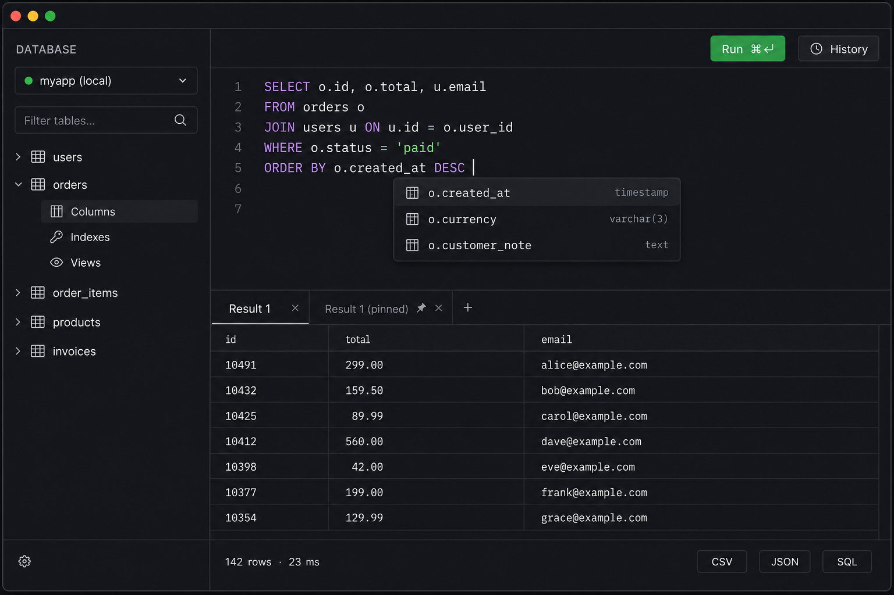
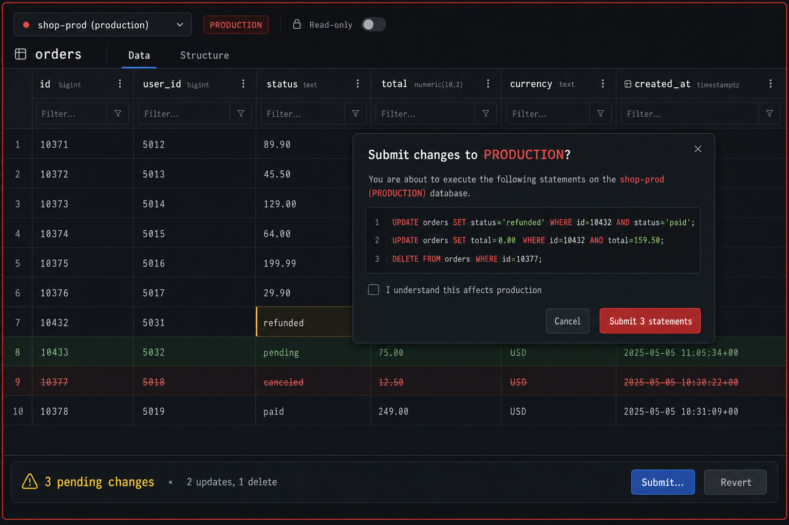

# PRD: Databaseverktøy i `e` — PhpStorm-paritet og forbi

| | |
| --- | --- |
| **Status** | Utkast |
| **Eier** | Knut W. Horne |
| **Baseline** | `e` v0.7.5 (juli 2026) |
| **Referansenivå** | PhpStorm 2026.x database tools (DataGrip-motoren) |

## 1. Bakgrunn og mål

`e` har i dag et databasepanel (⌘3) som dekker hverdags-browsing og som allerede
slår PhpStorm på alt som er *app-nært*: auto-tilkobling fra `.env`, skjema-diff
mot migrasjoner, modellgenerering fra tabeller, Eloquent-/query-builder-
completion fra live-skjema, EXPLAIN med agent-indeksforslag, og produksjonsvern.

Målet med dette dokumentet er å definere hva som skal til for at DB-panelet
også er *database-nært* på nivå med PhpStorm — slik at en Laravel-utvikler aldri
trenger å åpne TablePlus, DataGrip eller PhpStorm ved siden av. Suksesskriteriet
er enkelt: **alt en Laravel-utvikler gjør mot databasen i løpet av en
arbeidsdag, skal kunne gjøres bedre i `e`.**

### Mål

1. Funksjonell paritet med PhpStorm på de arbeidsflytene Laravel-utviklere
   faktisk bruker (konsoll, datagrid, skjemaobjekter, import/eksport, historikk).
2. Beholde og forsterke `e` sine differensiatorer (Laravel-integrasjon, agent,
   runtime-kobling) — pariteten skal bygges *oppå* dem, ikke ved siden av.
3. Trygghet som førsteklasses egenskap: det skal være vanskeligere å ødelegge
   produksjonsdata i `e` enn i noe annet verktøy.

### Ikke-mål

- Full DataGrip-erstatter for DBA-er (brukeradministrasjon, replikering,
  partisjonering, jobs/schedulers). Målgruppen er applikasjonsutviklere.
- Støtte for flere databasemotorer enn dagens fire (MySQL/MariaDB, PostgreSQL,
  SQLite, ClickHouse). Nye motorer er egne initiativ.
- Diagram-*redigering* (ERD-tegning som endrer skjema). Visning er i scope.

## 2. Målgruppe og scenarier

**Primærbruker:** Laravel-/PHP-utvikler som i dag bruker PhpStorm eller
VS Code + TablePlus, og som jobber mot lokal database (Grove/Docker) daglig og
staging/produksjon (via SSH-tunnel) ukentlig.

Kjernescenarier som skal være friksjonsfrie:

1. **Utforske**: «Hva ligger i `orders`-tabellen for kunde X?» — filtrer, sorter,
   følg foreign keys, se JSON-kolonner leselig.
2. **Spørre**: Skrive ad-hoc SQL med completion, kjøre, iterere, sammenligne to
   resultater, finne igjen queryen i morgen.
3. **Fikse data**: Rette en rad i staging trygt — se hva som blir endret før
   commit, med angremulighet og prod-vern.
4. **Diagnostisere**: «Hvorfor er denne siden treg?» — fra runtime-panelets
   query-liste via EXPLAIN til indeks-migrasjon.
5. **Flytte data**: Få en CSV fra kunde inn i en tabell; få et resultatsett ut
   som CSV/JSON/inserts til en kollega.

## 3. Nåsituasjon (v0.7.5)

Finnes og fungerer:

- Tilkoblinger: MySQL, PostgreSQL, SQLite, ClickHouse; auto fra `.env`, manuell
  med SSH-tunnel (passord/nøkkel); lagrede tilkoblinger per prosjekt
- Datagrid: browsing med sortering, kolonnefiltre, celle-redigering, ny
  rad-dialog, slett rad, FK-hopping, rad-cap med «truncated»-markering
- Struktur-fane: kolonner + indeksvisning
- Skrivevern: read-only per tilkobling, produksjon detekteres og beskyttes som
  standard, agent-queries krever consent-dialog
- Query-editor: ren tekstboks + lagrede queries per prosjekt, CSV-eksport
- EXPLAIN med agent-indeksforslag; «Explain with agent» på feilede queries
- Laravel-lag: skjema-diff, modellgenerering, Eloquent-completion,
  validation-rules fra skjema, inline SQL i PHP-strenger (highlighting,
  completion, kjør under markøren)
- Agent-socket: `db_schema` (fritt), `db_query` (consent)

Kjente mangler (dagens gap mot PhpStorm): SQL-konsollens redigeringsopplevelse,
query-historikk, import, flere eksportformater, transaksjonell redigering,
views/triggere/prosedyrer, søk i data, flere resultat-faner, ERD-visning.

## 4. Funksjonelle krav

Prioritet: **P0** = kreves for paritet, **P1** = paritet for kraftbrukere,
**P2** = forbi paritet (differensiator). Krav merket ✅ er levert i ≤ v0.7.5 og
står her for helhet.

### 4.1 Tilkoblinger og miljøer

| ID | Krav | Prioritet |
| --- | --- | --- |
| DB-101 | ✅ Auto-tilkobling fra `.env`, manuelle tilkoblinger, SSH-tunnel | — |
| DB-102 | Miljø-etikett per tilkobling: `local` / `staging` / `production`, med farge (grønn/gul/rød) synlig i panel-header, datagrid og konsoll. Auto-gjettes (hostname, `.env` vs manuell) men kan overstyres | P0 |
| DB-103 | ✅ Read-only-flagg per tilkobling; produksjon read-only som standard | — |
| DB-104 | Flere samtidige tilkoblinger åpne, med rask bytte (dropdown i panel-header); aktiv tilkobling alltid synlig med miljøfarge | P0 |
| DB-105 | Tilkoblingstest med tydelig feilmelding (DNS, auth, tunnel, driver) | P1 |
| DB-106 | Keychain-lagring av passord (macOS Keychain / Secret Service på Linux) i stedet for klartekst i prosjektfil | P1 |

### 4.2 Skjema-utforsker (objekttre)

| ID | Krav | Prioritet |
| --- | --- | --- |
| DB-201 | ✅ Tabelliste med kolonner og indekser | — |
| DB-202 | Views i objekttreet: liste, åpne definisjon (SQL), browse som tabell | P0 |
| DB-203 | Triggere og prosedyrer/funksjoner: liste + vis definisjon (read-only) | P1 |
| DB-204 | «Generate DDL» på tabell/view/indeks: vis `CREATE …`-setningen, kopier til utklippstavle | P1 |
| DB-205 | Søk/filter i objekttreet (skriv for å filtrere tabellnavn) | P0 |
| DB-206 | Radantall per tabell (lazy, ca-verdi) og tabellstørrelse i treet | P2 |
| DB-207 | ERD-visning: FK-graf over valgte tabeller (gjenbruk relasjonsgraf-motoren fra ⌘⌥R, men på DB-nivå — også for tabeller uten Eloquent-modell) | P2 |

### 4.3 Datagrid

| ID | Krav | Prioritet |
| --- | --- | --- |
| DB-301 | ✅ Sortering, kolonnefiltre, celle-redigering, ny rad, slett rad, FK-hopping | — |
| DB-302 | Paginering: «neste/forrige side» + hopp til side, med totalantall; rad-cap erstattes av ekte sider | P0 |
| DB-303 | Transaksjonell redigering: endringer (celler, nye rader, slettinger) samles lokalt og markeres visuelt; egen **Submit**-knapp kjører alt i én transaksjon, **Revert** forkaster. Direkte-skriv beholdes som opt-in for lokal utvikling | P0 |
| DB-304 | Verdi-editor: åpne celleverdi i eget felt/modal for lange tekster; JSON-kolonner vises formatert (pretty-print) med fold, og valideres før lagring | P0 |
| DB-305 | NULL håndteres eksplisitt: vis `NULL` distinkt fra tom streng; sett-til-NULL-handling | P0 |
| DB-306 | Kopier celle / rad (som CSV, JSON eller `INSERT`-setning) fra kontekstmeny | P1 |
| DB-307 | Dupliser rad som utgangspunkt for ny | P1 |
| DB-308 | «Relaterte rader»-oppslag: fra en rad, vis rader i andre tabeller som peker hit (reverse FK) | P1 |
| DB-309 | Binær-/blob-kolonner: vis størrelse + hex-preview i stedet for rå bytes | P2 |
| DB-310 | Cell-rendering av vanlige Laravel-typer: timestamps med relativ tid på hover, boolske kolonner som ✓/✗ | P2 |

### 4.4 SQL-konsollen

Dagens største gap. Konsollen skal oppleves som en editor, ikke en tekstboks.

| ID | Krav | Prioritet |
| --- | --- | --- |
| DB-401 | Syntax-highlighting i konsollen (gjenbruk tree-sitter-SQL fra inline-SQL-arbeidet) | P0 |
| DB-402 | Skjema-bevisst completion: tabellnavn, kolonnenavn (alias-bevisst: `o.` foreslår `orders`-kolonner), nøkkelord, funksjoner (gjenbruk completion-motoren fra inline SQL) | P0 |
| DB-403 | Multi-statement: kjør hele konsollen, kjør valgt tekst, eller kjør setningen under markøren (⌘⏎); hver setning får eget resultat | P0 |
| DB-404 | Flere resultat-faner: hver kjøring får en fane (med queryen som tooltip); faner kan pinnes; ikke-pinnede gjenbrukes | P0 |
| DB-405 | Query-historikk: alle kjørte queries logges per prosjekt (tid, tilkobling, radantall, varighet); søkbar liste, klikk for å gjenåpne i konsollen | P0 |
| DB-406 | ✅ Lagrede queries per prosjekt | — |
| DB-407 | Feilposisjonering: syntaksfeil fra serveren markerer riktig posisjon i konsollen der driveren oppgir den; «✨ Explain with agent» beholdes | P1 |
| DB-408 | Parametere: `:navn`-placeholdere prompter for verdi ved kjøring (med husk-siste) | P1 |
| DB-409 | Kansellerbar kjøring: lange queries kan avbrytes uten å fryse panelet | P0 |
| DB-410 | Format SQL-kommando i konsollen | P2 |

### 4.5 Import og eksport

| ID | Krav | Prioritet |
| --- | --- | --- |
| DB-501 | ✅ CSV-eksport av resultatsett | — |
| DB-502 | Eksportformater: JSON, `INSERT`-setninger, Markdown-tabell, TSV — fra både grid og konsollresultat | P0 |
| DB-503 | CSV-import til eksisterende tabell: kolonnemapping-dialog med forhåndsvisning av de første radene, typevalidering, og alt-eller-ingenting-transaksjon | P0 |
| DB-504 | Eksporter hel tabell (ikke bare synlig resultat), med progresjon og avbrudd | P1 |
| DB-505 | Kopier resultat til utklippstavle i valgt format uten å gå via fil | P1 |

### 4.6 Ytelse og diagnose

| ID | Krav | Prioritet |
| --- | --- | --- |
| DB-601 | ✅ EXPLAIN med agent-indeksforslag; indeksvisning i Structure | — |
| DB-602 | Strukturert EXPLAIN-visning: plan som tre/tabell med markering av full table scans og manglende indekser (ikke bare råtekst) | P1 |
| DB-603 | «Foreslå indeks → generer migrasjon»: agent-indeksforslaget skrives som ferdig Laravel-migrasjonsfil (gjenbruk kodegen) | P1 |
| DB-604 | Kobling fra runtime-panelet (⌘⌥I): «EXPLAIN denne queryen» på enhver observert query, med hopp til DB-panelet | P1 |
| DB-605 | Varighet og radantall vises for hver kjøring i konsoll og historikk | P0 |

### 4.7 Trygghet (forsterker DB-102/103/303)

| ID | Krav | Prioritet |
| --- | --- | --- |
| DB-701 | ✅ Prod-deteksjon med read-only som standard; consent-dialog for agent-queries | — |
| DB-702 | Destruktive setninger (`DROP`, `TRUNCATE`, `DELETE`/`UPDATE` uten `WHERE`) krever eksplisitt bekreftelse med setningen gjengitt — på *alle* miljøer, ikke bare prod | P0 |
| DB-703 | Ved skriv mot ikke-lokal tilkobling: bekreftelsesdialog viser miljøetikett i farge + antall rader som påvirkes | P0 |
| DB-704 | Databasesnapshots: ta snapshot (mysqldump/pg_dump/SQLite-kopi) og tilbakestill, én knapp per tilkobling (kun lokale miljøer). Integreres med agent-flyter («ta snapshot før migrasjon») | P2 |
| DB-705 | Angre-logg for datagrid-endringer i økten: liste over utførte skriv med generert motsatt setning der det er mulig | P2 |

### 4.8 Laravel- og agent-lag (forbi paritet — skal bevares og utvides)

| ID | Krav | Prioritet |
| --- | --- | --- |
| DB-801 | ✅ Skjema-diff, modellgenerering, Eloquent-/query-completion, validation-rules fra skjema, inline SQL i PHP | — |
| DB-802 | Factory-integrasjon: «Seed N rader» på tabell (kjører factory via Tinker); «Generer factory fra skjema» der factory mangler | P1 |
| DB-803 | Migrasjonsgenerering fra strukturendringer: endrer man kolonner/indekser i Structure-fanen, tilbys en generert migrasjon i stedet for direkte DDL (direkte DDL kun på lokale miljøer) | P2 |
| DB-804 | Agent-socket utvides: `db_explain` (fritt, read-only) og `db_snapshot` (consent) | P2 |
| DB-805 | Søk i data: «finn verdi i alle tabeller» (begrenset til tekstkolonner, med radgrense og avbrudd) | P2 |

## 5. Design

### 5.1 Overordnet layout

Ett panel, tre flater — objekttre til venstre, arbeidsflate (datagrid eller
konsoll) i midten, og kontekstuelle detaljer (verdi-editor, EXPLAIN, historikk)
som skuffer/modaler. Ingen nye toppnivå-paneler introduseres.

```
┌────────────────────────────────────────────────────────────────────┐
│ ● myapp (local) ▾   [PRODUCTION]   🔒 Read-only   ⚙                │  ← header
├──────────────┬─────────────────────────────────────────────────────┤
│ DATABASE     │  orders            [ Data ] [ Structure ] [ SQL ]   │
│ 🔍 filter…   │ ┌─────────────────────────────────────────────────┐ │
│ ▸ users      │ │  (datagrid  ELLER  konsoll + resultat-faner)    │ │
│ ▾ orders     │ │                                                 │ │
│   · Columns  │ │                                                 │ │
│   · Indexes  │ └─────────────────────────────────────────────────┘ │
│ ▸ Views      │  142 rows · 23 ms          [CSV ▾] [⏱ History]      │  ← statuslinje
├──────────────┴─────────────────────────────────────────────────────┤
│ ⚠ 3 pending changes · 2 updates, 1 delete      [Submit…] [Revert]  │  ← kun ved endringer
└────────────────────────────────────────────────────────────────────┘
```

- **Header** viser alltid aktiv tilkobling med miljøprikk (grønn/gul/rød),
  miljø-badge for ikke-lokale miljøer, og read-only-toggle (DB-102/103/104).
- **Objekttreet** har filterfelt øverst (DB-205); tabeller, views (DB-202) og
  per-tabell-noder for Columns/Indexes. Triggere/prosedyrer (DB-203) i egen
  gruppe nederst.
- **Arbeidsflaten** har tre faner per tabell/kontekst: Data, Structure, SQL.
  SQL-fanen er konsollen — den kan også åpnes uten tabellvalg.
- **Endringslinjen** (pending changes) vises kun når det finnes usendte
  endringer (DB-303), med Submit/Revert. Den er global for panelet, ikke per
  tabell, så endringer aldri «glemmes» bak en fanebytting.

### 5.2 SQL-konsollen



*Konsollen: tre-sitter-highlightet SQL, alias-bevisst kolonnecompletion med
typehint, resultat-faner med pin, radantall + varighet, eksportknapper.*

- **Editoren er en ekte `e-core`-buffer** med SQL-grammatikk: samme markør-,
  seleksjons- og keymap-oppførsel som editoren ellers (DB-401).
- **Completion-popup** gjenbruker editorens completion-UI: kolonneikon,
  navn, og datatype som dim høyrestilt hint (DB-402). Alias løses fra
  setningen (`o.` → `orders`).
- **Kjøring**: ⌘⏎ kjører setningen under markøren; er tekst markert, kjøres
  markeringen; «Run»-knappen kjører hele konsollen (DB-403). Under kjøring
  bytter Run-knappen til «Stop» (DB-409) og statuslinjen viser spinner + tid.
- **Resultat-faner** ligger mellom konsoll og grid: ikke-pinnede faner
  gjenbrukes av neste kjøring, pin-ikonet fryser en fane for sammenligning
  (DB-404). Tooltip på fanen viser queryen.
- **Historikk** åpnes fra ⏱-knappen som en skuff fra høyre: kronologisk liste
  med query (én linje, ellipsert), tilkobling, radantall, varighet og
  tidspunkt; søkefelt øverst; klikk limer queryen inn i konsollen (DB-405).
- **Feil** vises i resultatområdet med rød kant, feilmelding, posisjon
  markert i konsollen der driveren oppgir den, og «✨ Explain with agent»
  (DB-407).

### 5.3 Datagrid og transaksjonell redigering



*Datagrid mot produksjon: rød ramme + PRODUCTION-badge, endrede celler med gul
markering, ny rad grønn, sletting rød gjennomstreket, endringslinje nederst og
submit-dialog som gjengir de eksakte setningene.*

- **Kolonneheader** viser navn + dim datatype; ⋮-meny per kolonne har sorter,
  filter, skjul, og «Set NULL» på markert celle (DB-305). Filterraden ligger
  rett under headeren (DB-301).
- **Endringsmarkering** (DB-303): redigert celle får gul venstrekant + svak
  gul bakgrunn; ny rad grønn tint; slettet rad rød tint med gjennomstreking.
  Ingenting skrives før Submit.
- **Submit-dialogen** gjengir de eksakte parametriserte setningene som skal
  kjøres — samme «vis hva som skjer»-prinsipp som agent-consent. Mot
  produksjon kreves i tillegg avkrysning (DB-702/703). Mot lokale miljøer er
  dialogen én bekreftelsesknapp uten avkrysning.
- **FK-verdier** er lenker (understreket på hover); klikk hopper til referert
  rad (DB-301). «Relaterte rader» (DB-308) ligger i radens kontekstmeny.
- **Celle-editor** (DB-304): Enter redigerer inline; ⌘Enter eller dobbeltklikk
  på lange verdier åpner verdi-editoren som modal med tekstområde, JSON
  pretty-print/fold for JSON-kolonner, og valider-før-lagre.
- **Paginering** (DB-302): «‹ 1–500 av 12 340 ›» i statuslinjen; sidestørrelse
  i settings.
- **NULL** rendres som dim kursiv `NULL`, aldri som tom streng (DB-305).

### 5.4 Miljøfarger og trygghet i UI

| Miljø | Prikk/badge | Grid-ramme | Skriv |
| --- | --- | --- | --- |
| `local` | grønn, ingen badge | ingen | direkte eller transaksjonelt (opt-in) |
| `staging` | gul + badge | gul 1px når skrivbar | alltid transaksjonelt + bekreftelse |
| `production` | rød + badge | rød 2px når skrivbar | read-only som standard; skriv krever toggle + avkrysning |

Fargene følger temaets semantiske paletter (success/warning/danger) og vises i
panel-header, tilkoblings-dropdown, submit-dialoger og consent-dialoger for
agent-queries. En skrivbar prod-tilkobling skal være visuelt umulig å overse.

### 5.5 Dialoger og skuffer

- **CSV-import** (DB-503): tre-stegs modal — filvalg → kolonnemapping
  (kildekolonne → tabellkolonne, med forhåndsvisning av de fem første radene
  og typevalidering markert per celle) → oppsummering («12 340 rader →
  `orders`, 2 kolonner ignoreres») med import som transaksjon og
  progresjonslinje.
- **EXPLAIN** (DB-602): åpnes som skuff under resultatet; plan som innrykket
  tre med kostnad/radestimat per node; full table scans og «no index used»
  flagges med ⚠ og rød tekst; «✨ Foreslå indeks»-knapp → agent → generert
  migrasjon (DB-603).
- **Verdi-editor, historikk, DDL-visning** («Generate DDL», DB-204) bruker
  samme skuff-mønster som EXPLAIN — høyre side, lukkes med Esc, stjeler aldri
  fokus fra grid/konsoll uten klikk.

### 5.6 Tastatur

Alle flyter er tilgjengelige fra kommandopaletten (⌘⇧P) med prefiks
«Database: …». Direkte snarveier i panelet:

| Snarvei | Handling |
| --- | --- |
| ⌘3 | Åpne/lukk databasepanelet |
| ⌘⏎ | Kjør setning under markøren / markering |
| ⌘⇧⏎ | Kjør hele konsollen |
| ⌘T (i panel) | Ny resultat-fane / pin gjeldende |
| ⌘S (i grid) | Submit ventende endringer |
| ⌘Z (i grid) | Angre lokal (usendt) endring |
| Esc | Lukk skuff/modal; deretter Revert-fokus |
| ⌘F (i grid) | Fokus kolonnefilter |
| ⌥⌘H | Åpne query-historikk |

### 5.7 Tilstander

- **Tom tilstand** (ingen tilkobling): sentrert kort med «Connect from .env»
  (primær, når `.env` finnes) og «Add connection manually» — samme mønster som
  welcome-skjermen.
- **Laster**: skeleton-rader i grid (ikke spinner-overlay); konsollen forblir
  interaktiv mens forrige resultat lastes.
- **Feil på tilkobling**: inline-kort i panelet med feilkategori (DNS, auth,
  tunnel, driver — DB-105) og «Test connection»-knapp; aldri en blokkerende
  dialog.
- **Alle operasjoner > 200 ms** viser progresjon og kan avbrytes; all I/O går
  via `spawn_bg`/`create_ext_action` (aldri på UI-tråden).

### 5.8 Konsistens

Gjenbruk eksisterende byggesteiner: toolbar-knapper, consent-dialogen
(agent-queries og submit deler visuell form), diff-/review-mønsteret, skuffer
og faner fra editoren. DB-panelet skal se ut som `e` — ikke som et innbakt
fremmed verktøy.

## 6. Tekniske føringer

- Alt databasespesifikt forblir i `e-db` (driverne); `e-app/src/db_state.rs`
  eier tilstand, `db_view.rs` kun visning. Konsollens editor gjenbruker
  `e-core`-bufferen med SQL-grammatikk, slik at completion/highlighting deler
  kode med inline-SQL.
- Query-historikk lagres i SQLite under `~/.config/e/` (én DB, prosjekt-nøkkel),
  ikke JSON — den vokser ubegrenset og må være søkbar.
- Kansellering (DB-409): kjør queries på dedikert tråd per tilkobling med
  kill-mekanisme per driver (`KILL QUERY` for MySQL, `pg_cancel_backend`/
  driver-API for PostgreSQL, avbrytbar handle for SQLite).
- Transaksjonell redigering (DB-303) bygger endringssettet som en liste av
  parametriserte setninger; genereres og vises for brukeren før submit
  (samme «vis hva som skjer»-prinsipp som agent-consent).
- ClickHouse er analytisk og har ikke transaksjoner — DB-303/503 degraderer
  til direkte-skriv med ekstra bekreftelse der.

## 7. Faseplan

| Fase | Innhold | Kravdekning |
| --- | --- | --- |
| **Fase 1 — Konsollen** | Highlighting, completion, multi-statement, resultat-faner, historikk, varighet, kansellering | DB-401–405, 409, 605 |
| **Fase 2 — Trygg redigering** | Transaksjonell redigering, verdi-/JSON-editor, NULL-håndtering, destruktiv-vern, miljøetiketter, paginering | DB-302–305, 702–703, 102, 104 |
| **Fase 3 — Data inn/ut** | Eksportformater, CSV-import, kopier-som, views i treet, tre-søk | DB-502–503, 505, 202, 205 |
| **Fase 4 — Kraftbruker** | Strukturert EXPLAIN, indeks-migrasjon, runtime-kobling, factory-integrasjon, DDL-generering, relaterte rader, parametere | DB-602–604, 802, 204, 308, 408 |
| **Fase 5 — Forbi** | Snapshots, ERD, angre-logg, migrasjon-fra-strukturendring, søk i data, radantall i tre | DB-704, 207, 705, 803, 805, 206 |

Fase 1 og 2 utgjør til sammen «paritet i praksis» — etter dem skal en
PhpStorm-bruker ikke savne noe daglig. Fase 3 lukker de ukentlige behovene,
fase 4–5 er forspranget.

## 8. Suksessmetrikker

- En definert «paritetssjekkliste» (kjernescenariene i §2) kan gjennomføres
  uten å forlate `e` — verifiseres manuelt per release.
- Ingen datatap-hendelser: alle skriv mot ikke-lokale miljøer går via
  bekreftelse; destruktive setninger kan ikke kjøres ureflektert.
- Konsollen brukes: query-historikken (lokal) viser at konsollen erstatter
  eksterne verktøy i eget daglig arbeid (dogfooding).
- Ytelse: åpne panel < 100 ms; completion i konsoll < 50 ms; grid ruller flytende
  med 10 000 rader lastet.

## 9. Risiko og avbøtninger

| Risiko | Avbøtning |
| --- | --- |
| Driver-forskjeller (fire motorer × alle features) gir kombinatorisk kompleksitet | Kapabilitets-flagg per driver i `e-db` (`supports_transactions`, `supports_kill`, …); UI degraderer eksplisitt i stedet for å feile |
| Transaksjonell redigering med samtidige eksterne endringer (optimistic locking) | Submit matcher på de opprinnelige verdiene i `WHERE`-klausulen; ved 0 raders treff varsles konflikt og grid refreshes |
| Query-kansellering er driver-spesifikk og skjør | Fallback: la queryen løpe ut i bakgrunnen, men frigjør UI og marker resultatet som forkastet |
| Historikk-DB vokser | Rullerende grense (f.eks. 10 000 innslag) + manuell tømming i settings |
| Scope-kryp mot DataGrip | Ikke-målene i §1 håndheves; nye motorer/DBA-features krever egen PRD |

## 10. Åpne spørsmål

1. Skal konsoll-faner persisteres på tvers av økter (som editor-tabs) eller er
   historikken nok?
2. Miljøetikett: skal `staging` også være read-only som standard, eller kun prod?
3. CSV-import: trenger fase 3 også Excel (`.xlsx`), eller er CSV nok for målgruppen?
4. Snapshots (DB-704): begrenses til SQLite/MySQL lokalt i første omgang, eller
   må PostgreSQL med fra start?
